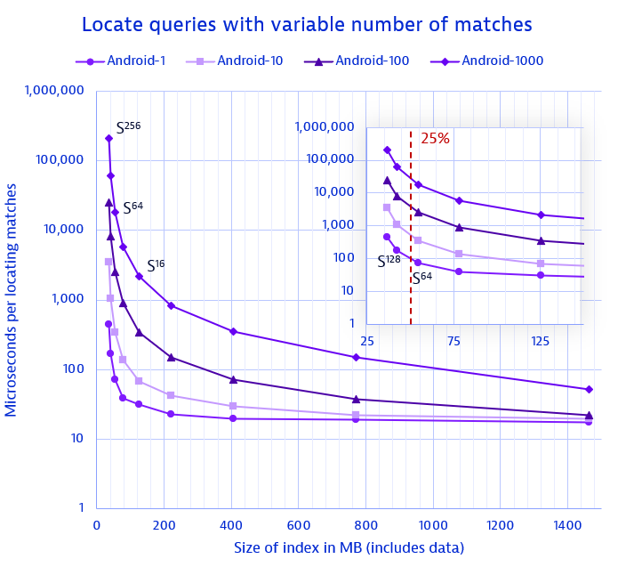
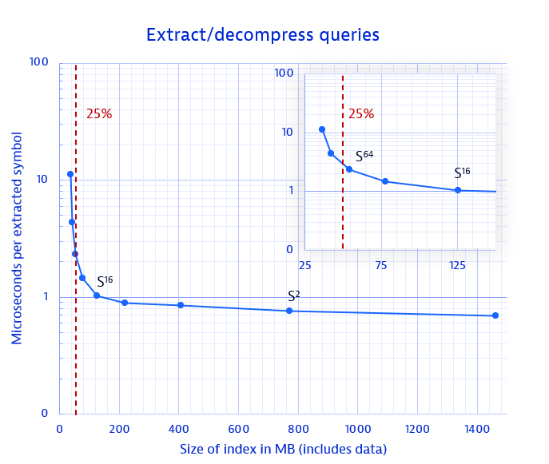
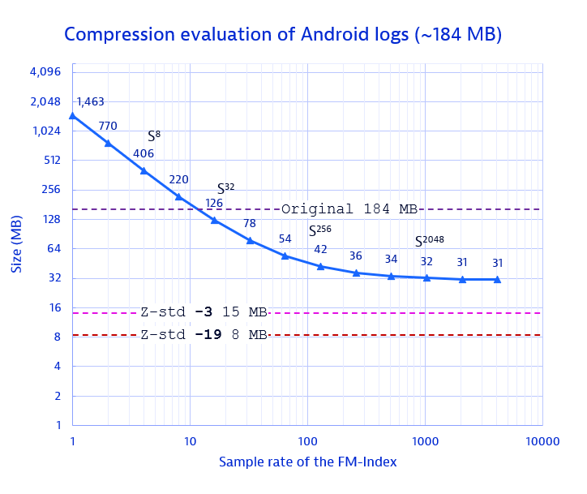

# index4j

This repository is a Java library developed by Dynatrace that implements the FM-Index succinct data structure. The FM-Index takes 
advantage of the relationship between the suffix array and the Burrows-Wheeler transform to enable both compression and
fast queries. 

This index is specifically suited for compressing and querying text files without requiring prior tokenization. 
This means that you can compress a text file and then query it for arbitrary substrings without the need to fully 
decompress it, i.e., only the compressed size is required to be in memory. Furthermore, query performance depends on 
the number of located matches and total decompressed bytes, rather than whether the query is aligned with a particular
token.

In addition, this repository also contains further data structures for working with bit vectors and integer sequences in Java. 

## Content

- [First steps](#first-steps)
- [Supported data structures](#supported-data-structures)
- [How-to and example use cases](#how-to)
- [Benchmarks](#benchmarks)
- [Details about the data structures](#details)
- [About this project](#about-this-project)

## First steps

TODO add dependency on maven

## Supported data structures

- [Fm-Index](indices/src/main/java/com/dynatrace/fm/FmIndex.java): supports `count`, `locate`, `extract` and `extractUntilBoundary` (along with its left and right variations) with arbitrary patterns while compressing your data. In the case of logs, roughly 20% of the input size is required to store both data and index.
- [RrrVector](indices/src/main/java/com/dynatrace/bitsequence/RrrVector.java) (Raman, Raman & Rao): compressed bit vectors which both compress and enables rank and select queries.
- [SuffixArray](indices/src/main/java/com/dynatrace/suffixarray/SuffixArray.java): supports querying arbitrary patterns on input text requiring `O(n logn)` time and `O(5n)` space.
- [Wavelet FBB](indices/src/main/java/com/dynatrace/wavelet/WaveletFixedBlockBoosting.java): Fast wavelet trees that compress and support rank and select queries on arbitrary sequences.
- [Burrows-Wheeler transform](indices/src/main/java/com/dynatrace/encoding/BurrowsWheelerTransform.java): enables calculating the BWT of inputs as well as compute redundancy metrics.

## How-to

### Using the FM-Index

The following examples show how to make use of the provided FM-Index implementation. Note that both compression and 
query speed are controlled by the `sample rate` parameter (find more details [here](#details)). In essence, a larger 
`sample rate` results in better compression but slower query performance, and viceversa. Note that "larger" here means 
"larger distance" between samples, and therefore, actually translates into fewer samples.

#### Creating an FM-Index

The following snippet creates an FM-Index for a char array `text` using a sample rate of `32` and enabling
the extraction/decompression of the index.

```java
char[] text = ...
FmIndex fmi = new FmIndexBuilder()
        .setSampleRate(32)
        .setEnableExtraction(true)
        .build(text);
```

To get some statistics, we can do the following:
```java
System.out.println(fmi.getAlphabetLength());                            // how many symbols
System.out.println(fmi.getInputLength());                               // the length of the input `text`
int size = Serialization.writeToByteArray(FmIndex::write, fmi).length;  // actual compressed size
System.out.println((size * 100 / fmi.getInputLength()) + "%)");         // relative size to the input
```

Note that the original input string is no longer required to perform any query at all, and in fact the whole input 
can be retrieved back by decompressing or extracting between `0` and `|text|`.

#### Counting occurrences of a pattern

Count how many times the pattern ` DEBUG ` (with spaces before and after) is in the input data.
```java
char[] pattern = " DEBUG ".toCharArray();
System.out.println(fmi.count(pattern));
```

#### Locating the positions of an occurrence

Using the previous pattern, find at most 10 matches and their position in the original input.
```java
int[] locations = new int[10];
int found = fmi.locate(pattern, 0, pattern.length, locations, 10); // find max. 10 matches
System.out.println(found); // print number of matches
System.out.println(Arrays.toString(locations)); // print the locations of the matches
```

#### Extracting key-value pairs

Using the previously found matches and locations, extract the right-most string containing the match and until a comma `','` is found.
```java
char[] destination = new char[100]; // maximum length per extraction
for (int i = 0; i < found; i++) {
    int length = fmi.extractUntilBoundaryRight(locations[i] - 1, destination, 0, ','); // extract previous locations until finding a comma
    System.out.println(new String(destination, 0, length)); // print the extracted string
}
```

#### Extracting whole records

Extracting the full string, left and right from every match until a line separator `'\n'` is found.
```java
char[] destination = new char[512]; // maximum length per extraction 
for (int i = 0; i < found; i++) {
    int length = fmi.extractUntilBoundary(locations[i], destination, 0, '\n');
    System.out.println(new String(destination, 0, length));
}
```

#### Serializing

All data structures (except the naive `WaveletTree`) can be serialized and deserialized
via the [SerializationReader](indices/src/main/java/com/dynatrace/serialization/SerializationReader.java) and
the [SerializationWriter](indices/src/main/java/com/dynatrace/serialization/SerializationWriter.java), respectively.

You can do so as shown below:

```java
FmIndex fmi = new FmIndexBuilder().build(...);
byte[] serialized    = Serialization.writeToByteArray(FmIndex::write, fmi);
FmIndex deserialized = Serialization.readFromByteArray(FmIndex::read, serialized);
```

### Using RRR Bit vectors

Similarly to the FM-Index, RRR bit vectors also make use of the sample rate. A higher sample rate results in using less
space but at the expense of slower rank and access queries. In particular, a sample rate of e.g. `32`
will result in saving a prefix sum every 32 bits, as well as saving the position of offsets
every 32 bits. Therefore, in the worst case, up to `32/BLOCK_SIZE` blocks need to be traversed before finding
the rank or access answer.

#### Creating RRR Bit vectors

We have two options to create RRR bit vectors: either through an array of integers, which we interpret as a sequence
of bits (e.g. if the int value is `2` then we have a bit sequence of `010...000000`) or creating it through an already
existing `BitVector` from the `sux4j` library. For example, using a sequence of integers and a sample rate of `32`:

```java
int[] array = new Random().ints(1000).toArray();
RrrVector rrr = new RrrVector(array, 32);
```

Or from a `BitVector`:

```java
int lengthInBits = 1000;
BitVector bv = LongArrayBitVector.getInstance().length(lengthInBits);
// Fill in some values
Random random = new Random();
for (int i = 0; i < lengthInBits; i++) {
    bv.set(i, random.nextBoolean());
}
// Create it
RrrVector rrr = new RrrVector(bv, 32);
```

#### Ranking zeros or ones

The following snippet shows how to count the number of 1's or 0's until a given position (exclusive).

```java
int[] array = ...
RrrVector rrr = new RrrVector(array, 32);
System.out.println(rrr.rankOnes(10)); // Number of 1's until position 10
System.out.println(rrr.rankZeroes(50)); // Number of 0's until position 50
```

#### Access an arbitrary position

Get the value of the bit at position `i`:

```java
int[] array = ...
RrrVector rrr = new RrrVector(array, 32);
System.out.println(rrr.access(7)); // Get the bit value as a boolean (true or false) of the bit sequence at position 7
```

#### Serializing

Similar to the FM-Index, we can serialize and deserialize our RRR bit vectors as follows:

```java
int[] array = ...
RrrVector rrr = new RrrVector(array, 32);
byte[] serialized      = Serialization.writeToByteArray(RrrVector::write, rrr);
RrrVector deserialized = Serialization.readFromByteArray(RrrVector::read, serialized);
```

### Using Wavelet trees

Currently, two implementations of the wavelet tree are supported. However, only the 
[Fixed-block boosting wavelet tree](indices/src/main/java/com/dynatrace/wavelet/WaveletFixedBlockBoosting.java) should be
used since its performance and memory consumption is much better than the vanilla wavelet tree implementation.

The Fixed-block boosting wavelet tree (FBB-WT in advance) also uses the `sample rate` parameter since it is composed of multiple RRR bit
vectors. 

#### Creating FBB-WT

The FBB-WT can be built from either a sequence of chars or shorts. In any case, both are interpreted as symbols and should
be mapped to a sequence `{0,1,2, ..., n}` such that `v_{i+1} = v_{i} + 1` for all `i`. This allows for a larger alphabet,
up to `32,768` different symbols, whereas otherwise if there is a single symbol with a value above `32,768` it will fail.
The following snippet shows how to create an FBB-WT without such mapping:

```java
char[] text = "This is an example".toCharArray();
WaveletFixedBlockBoosting wavelet = new WaveletFixedBlockBoosting(text);
```

And the following includes a mapping:

```java
char[] text = "Los erizos pasean junto a la torre".toCharArray();

Map<Character, Short> map = new HashMap<>();
short code = 0;
for (char c : text)
    if (map.putIfAbsent(c, code) == null) ++code;

short[] mappedSequence = new short[text.length];
for (int i = 0; i < text.length; i++)
    mappedSequence[i] = map.get(text[i]);

WaveletFixedBlockBoosting wavelet = new WaveletFixedBlockBoosting(mappedSequence);
```

#### Ranking symbols

By generalizing the bit vector structure, the FBB-WT is able to rank any symbol:

```java
char[] text = ...
WaveletFixedBlockBoosting wavelet = new WaveletFixedBlockBoosting(text);
long howManyZs = wavelet.rank(60, map.get('z')); // counts how many times the letter 'z' appears before position 60
```

#### Accessing symbols

We can also retrieve the original symbol at position `i`:

```java
char[] text = ...
int i = 33;
WaveletFixedBlockBoosting wavelet = new WaveletFixedBlockBoosting(text);
long ithAndSymbol = wavelet.inverseSelect(i); 
// Note that this long contains two ints: the first one is the number of the occurrence and the second one is the symbol value
assert text[i] == (char) ithAndSymbol; // by casting it to char we are taking the symbol bytes only
```

#### Serializing

Same approach as in previous occasions:

```java
char[] text = ...
WaveletFixedBlockBoosting wavelet = new WaveletFixedBlockBoosting(text);

byte[] serialized = Serialization.writeToByteArray(WaveletFixedBlockBoosting::write, wavelet);
WaveletFixedBlockBoosting deserialized = Serialization.readFromByteArray(WaveletFixedBlockBoosting::read, serialized);
```

## Benchmarks

The [jmh package](indices/src/jmh/java/com/dynatrace) contains ready-to-run benchmarks for the FM-Index, the RRR bit
vector and the Suffix Array. Most of the classes contain results which were run with the `Android.log` dataset of the
public repository [loghub](https://zenodo.org/records/3227177/files/Android.tar.gz?download=1). The benchmarks are divided into three types:
- `Ingest`: Measures how long it takes to create the data structure given the input.
- `Throughput`: Measures the query performance of the data structure as function of the sample rate.
- `SerializedSize`: Measures the size of the data structure once it is serialized.

The additional `state` type simply holds the state necessary to run the benchmarks.
The benchmarks `jar` can be built with the following command:

`./gradlew clean jmhJar`

And then run as follows:

`java -jar indices/build/libs/benchmarks.jar <regex matching name of benchmark> -p parameter1=value1 -p parameter2=value2 ...`

For example:

`java -jar indices/build/libs/benchmarks.jar FmIndexSerializedSizeBenchmark -p data=Android.log -p sampleRate=8,16,32,64`

### Infrastructure
The following benchmarks were run with 3 forks, each one running 5 warmup iterations and 10 measurement iterations.
They were run on a `Xeon W-10885@2.40GHz` with disabled Turbo Boost and 64 GB of RAM. Note that a more automated 
approach for benchmarking is intended for future work.

### Trade off plots between speed and space

The following plots summarize the general behavior of the FM-Index data structure for the locate and extract queries.
The `Android.log` dataset of the public repository [loghub](https://zenodo.org/records/3227177/files/Android.tar.gz?download=1) was used.
It contains exactly `1,555,005` lines, totalling `184` MB of data with an alphabet containing over `1,000` different symbols (letters).

#### Locate queries



The plot depicts the number of microseconds required for locating a variable number of matches (either 1, 10, 100 or 1,000)
as a function of the size, which depends on the value of the `sample rate`. The red dotted line in the zoomed-in region
shows the performance that can be achieved if using a `sample rate` that results in roughly 25% of the original input size
(including both index and data).

As can be seen, locate queries can be done in microseconds time depending on sample rate and output size,
for example, at 25% of the original size (achieved approximately with a sample rate of 64) gets us to 100 microseconds per output match.
The higher the number of output matches, the better the per-match average location time, e.g., for 100 matches it goes down to ~25 microseconds per match.

#### Extract/decompress queries



Similarly to locate queries, the extract/decompress queries are also affected by sample rate.
At a 25% size (or sample rate of 64), we can extract at a rate of one symbol per ~2 microseconds.
This translates into the fact that if we need to extract a full
log record of ~300 characters, we can expect roughly ~300 to ~600 microseconds, or half a millisecond. On the contrary,
if working with key/value pairs of e.g. size 30 characters, then ~30 to ~60 microseconds per extraction is reasonable.

#### Compression evaluation



How much can we compress the FM-Index while still being queryable depending on the sample rate?
First, when the size becomes asymptotic it is worth noting that the queries become much slower. However, this can be
still be useful if for example the use case requires higher compression and only sporadic querying.
For reference, the close to theoretical compression limit with Z-standard is included, at two levels of compression.
Notice that the FM-Index is the index as well (not just data, as opposed to the Z-standard compression).
It can be seen that the FM-Index requires around ~4 times the size of the Z-standard compressed file (which
already represents only 25% of the original file size) when
used with reasonable sample sizes (such as 64 or 128), which still offer high speed queries. Nevertheless,
when reaching the compression limits at a sample rate of ~1024 or higher, the FM-Index only requires ~2 times
the space.

#### Index construction runtime

The construction time of the FM-Index depends on building multiple other data structures which, although all linear
in runtime, still contribute towards a larger constant build time. In this line, you can expect the provided 
implementation of the FM-Index to process inputs at roughly 2 MB/s 
(see the [benchmark](indices/src/jmh/java/com/dynatrace/fm/FmIndexIngestBenchmark.java) for more details). This
translates into a 200 MB input text requiring approximately a minute and a half to build the index. The 
construction time is also affected by the `sample rate` but to a much smaller degree in comparison with
the compression or query performance, and can be almost ignored for practical purposes. Luckily,
building the index is required only once per input.

## Details

### FM-Index
An FM-Index is a compressed full-text substring index based on suffix arrays, bit vectors, wavelet trees and the
Burrows–Wheeler transform. It can be used to find the number of occurrences of a pattern without prior tokenization
within the compressed text, as well as locate the position of each occurrence and extract (decompress) the matched strings 
or their vicinity. The query time and the required storage space have a sublinear complexity with respect to the size of 
the input data. It is used extensively in the world of bioinformatics.

Supported operations:
- `count` enables to count the number of occurrences of a given pattern. This is extremely fast.
- `locate` enables to find all the leftmost starting positions of a given pattern. Its speed will depend on the parameter `sample rate` which trades off space for speed. A `sample rate` of `4` means to store an additional integer every four input symbols but also means that up to `4` additional rank queries will be necessary per query. Therefore, more position integers require more space but reduce the number of searches.
- `extract` enables extracting original input text from the compressed index between given positions. Its performance is also affected by the `sample rate`.
- `extractUntilBoundary` enables extracting a window of the original text delimited by a boundary character (e.g., a record delimiter such as `\n`)

As of now, the FM-Index implementation supports up to 32,768 different UTF-8 encoded characters. So far it has been tested
with data inputs of around `~400` MB, including general text documents, system logs, system traces, etc.

References:
- [Wikipedia](https://en.wikipedia.org/wiki/FM-index)
- Ferragina, Paolo, and Giovanni Manzini. ["Opportunistic data structures with applications."](https://doi.org/10.1109/SFCS.2000.892127) In Proceedings 41st annual symposium on foundations of computer science, pp. 390-398. IEEE, 2000.

### Suffix arrays
A suffix array is a sorted array of all suffixes of an input string. It can be used as index to locate all occurrences of
a given substring `p` by performing two binary searches per pattern. The drawback of a suffix array is its usually large size. 
The FM-Index, as described above, tackles some of its shortcomings.

The version used here is a modification of the [JsuffixArray Repository](https://github.com/carrotsearch/jsuffixarrays)
which in turn is a port of the original `divsufsort` implementation (find it [here](https://github.com/y-256/libdivsufsort))

- [Wikipedia](https://en.wikipedia.org/wiki/Suffix_array)
- [JsuffixArray repository](https://github.com/carrotsearch/jsuffixarrays)

### RRR Bit vectors
A bit vector is a string of bits, as the name indicates. Without supporting data structures, rank, select or access queries
on the bit strings are very slow (e.g. `O(n)`). The RRR bit vectors are a data structure built on top of the bit string
that answers e.g. rank queries in nearly constant time while also compressing it with space requirements close to the
zero-th entropy.

For further details see:
- [RRR bit vector tutorial](https://www.alexbowe.com/rrr/)
- Raman, Rajeev, Venkatesh Raman, and Srinivasa Rao Satti. "Succinct indexable dictionaries
  with applications to encoding k-ary trees, prefix sums and multisets." ACM Transactions on Algorithms (TALG) 3, no. 4 (2007): 43-es.
- Claude, Francisco, and Gonzalo Navarro. "Practical rank/select queries over arbitrary sequences." In International Symposium on String 
  Processing and Information Retrieval, pp. 176-187. Berlin, Heidelberg: Springer Berlin Heidelberg, 2008.

### Wavelet trees / matrix / block-boosting
The Wavelet Tree is a succinct data structure to store strings in compressed space.
It generalizes the rank, select and access operations defined on bit vectors to arbitrary alphabets. This means that you
can perform queries on arbitrary symbols on an arbitrarily long string without requiring to keep the whole
string in memory. An example rank query is "how many times does the symbol `c` appear in string `s` between positions `p1` and `p2`".
With the combination of RRR bit vectors, the wavelet tree can answer e.g. rank queries in `O(log2 |A|)`, where `A` is the alphabet used in the input string.

Note that here the implementation used is the fixed-block boosting wavelet tree which is based on the clever idea that 
because we represent the Burrows-Wheeler transform (and not the input corpus itself), it is actually better to build multiple
wavelet trees over the transform. These are called blocks, and because characters in the transform are
more likely to be adjacent to each other (creating the so-called "BW-Runs"), the alphabet is usually smaller
as well, therefore requiring less levels in the tree to represent the transform.

Supported operations:
- `rank` enables to count the number of occurrences of a symbol `c` between positions `p1` and `p2` in logarithmic time (as opposed to naive `O(p2-p1)` which grows linearly with the difference of positions).
- `access` enables to retrieve the symbol at position `p`. Remember that the wavelet tree does not store the original input string.
- `select` answers at which position is the `i-th` appearance of symbol `c`.

References:
- Gog, Simon, Juha Kärkkäinen, Dominik Kempa, Matthias Petri, and Simon J. Puglisi. "Faster, minuter." In 2016 Data Compression Conference (DCC), pp. 53-62. IEEE, 2016.
- Gog, Simon, Juha Kärkkäinen, Dominik Kempa, Matthias Petri, and Simon J. Puglisi. "Fixed block compression boosting in FM-indexes: Theory and practice." Algorithmica 81 (2019): 1370-1391.
- [Original implementation](https://github.com/dominikkempa/faster-minuter) by Dominik Kempa

### Burrows-Wheeler transform

The Burrows-Wheeler transform is a rearrangement of an input string into runs of similar characters. For example, the
word `^BANANA$` would be rearranged into `BNN^AA$A`, where two `N`s and `A`s are adjacent. In the case of longer strings,
this usually means compression can be applied, therefore making it a lossless compression algorithm.
Because of its relation to the Suffix array via the LF-Mapping, it is very useful for the FM-Index as a way of navigating 
a suffix array without requiring to store all suffixes. It can also be used as a measure of the compressibility or redundancy of a string.

References
- [Wikipedia](https://en.wikipedia.org/wiki/Burrows%E2%80%93Wheeler_transform)
- Manzini, Giovanni. "An analysis of the Burrows—Wheeler transform." Journal of the ACM (JACM) 48, no. 3 (2001): 407-430.

## About this project

Please note that this product is not officially supported by Dynatrace.